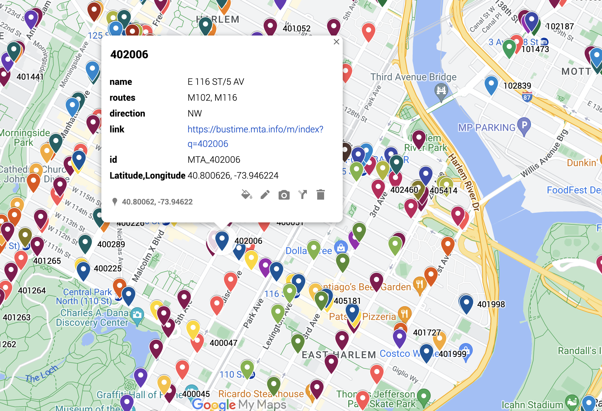

MTA Info
==============

This repo is used to build [this custom Google Map](https://www.google.com/maps/d/viewer?mid=1Y-euNeFcsu06Zxfdl6u6-sca3Yp-KYY).  
The map shows the codes for all the bus-stops within [MTA's bustime system](https://bustime.mta.info/m/index). You can use the code to check when the bus will arrive at that specific stop.
(The arrival times provided by Google are notoriously unreliable since they seem to rely on the scheduled times rather than the real-time data available through the MTA)

## Map

Each stop within the map contains all the information provided by the MTA, as well as a link to their bustime page ([example](https://bustime.mta.info/m/index?q=200884)). Unfortunately these are only usable on desktop (hyperlinks aren't allowed on the mobile app). With a phone, you'll have to [text the code to 511-123](https://bustime.mta.info/wiki/Help/SMSSearching).   
To make the map easier to navigate, stops are color-coded based on the direction of their route(s), and the stop-code is prominently displayed.  

### How to use
Open [the map](https://www.google.com/maps/d/viewer?mid=1Y-euNeFcsu06Zxfdl6u6-sca3Yp-KYY).  
To close, click on "VIEW MAP LEGEND", then CLOSE.  
After opening the map once, it should be automatically saved: go to "Saved" (at the lower center of the screen) -> scroll all the way to the bottom -> click on "Maps".

### myMTA
After building this, I found out that [the MTA has an app](https://en.wikipedia.org/wiki/MYmta) that provides this information within a map already. It also includes real-time information on the buses' location (using the same backend as the [bustime system](https://bustime.mta.info/m/index). This map isn't meant as a replacement for that app (there's no way to include the realtime info within a custom Google Map). But it is convenient to have the information easily available all within the same map/app, either on desktop or on Google Maps.

### Route groups
Unfortunately, Google Maps has a few restraints for custom maps:
 - there can only be a maximum of 10 layers (groups of pins appearing at the same time)
 - there can't be more than 2000 pins per layer
 
Because of this, the routes are grouped into arbitrary layers: the objective of these groups had to be to fit within the above restrictions.  
I would like to eventually group the routes in a way that makes more sense from a user's point of view, which would allow people to easily set the map to display only the routes relevant to their neighborhood/use-case.

## Code

### retrieving the data
All information is ultimately retrieved from the [MTA's API](https://bustime.mta.info/wiki/Developers/Index), although the relevant data is saved locally, so as to minimize the amount of repeat calls.  
The two functions querying the API are:
 1) `get_all_routes` to get information about all of the routes in the system
 2) `get_all_stops` to get information about all of the stops

### grouping the routes
Because of the constraints mentioned [here](#route-groups), it was necessary to devise a simple algorithm to build route groups such that:
 - each group contained a total of less than 2000 stops
 - there weren't more than 10 groups total
 
The algorithm, in [route_groups.py](./route_groups.py) is quite rudimentary but it works: 
 1. the routes are sorted by amount of total stops within the route
 2. from the sorted list, we select and remove the top, middle, and bottom elements
 (i.e. the routes with the most, the least, and the median amount of stops)
 3. these routes are put within a group
 4. we repeat step 2 until this group cannot take any more routes (the next route would tip it over the 2000-stop limit)
 5. we then create a new group, repeat steps 2-3-4 until the whole list is exhausted
 
### building the map
The map is built by importing all the CSV files created within `create_map_layers.py` into a Google [custom map](https://www.google.com/maps/about/mymaps/). I am not currently aware of a way to build custom Google Maps programmatically: as far as I know there is no API to create/edit custom maps.

To update the map:
 - delete all layers
 - import each route group (CSV files)
 - "Choose columns to position your placemarks": **Latitude,Longitude**
 - "Choose a column to title your markers": **code**
 - Style by -> group places by -> direction

### updating the data
If you run `python src/create_map_layers.py` and you already have all the data, the code will simply process the existing files within `data/` and re-create the CSV files for the map laters (in `data/layers`). The information is about bus routes and stops: these aren't subject to frequent changes.  
To run the full program and retrieve the latest data from the MTA, remove all files in `data/`, then run `python src/create_map_layers.py`. The data files are all part of git, so any updates will show up in your `git-diff`.
 
### Things to improve
See [TODO](./TODO.md).
